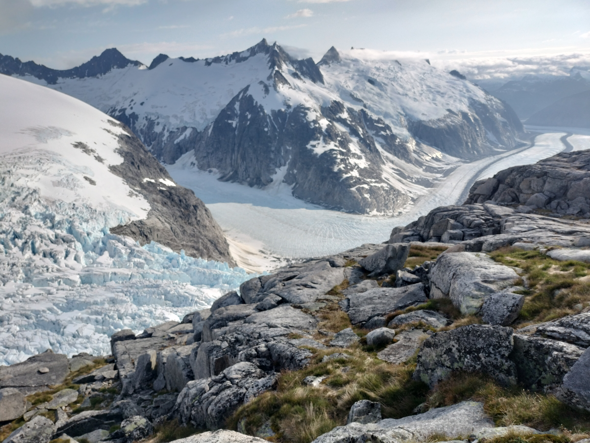
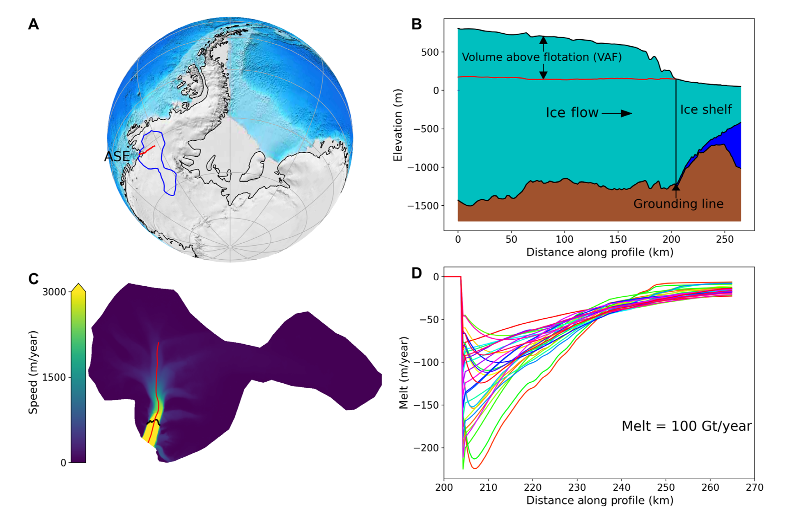
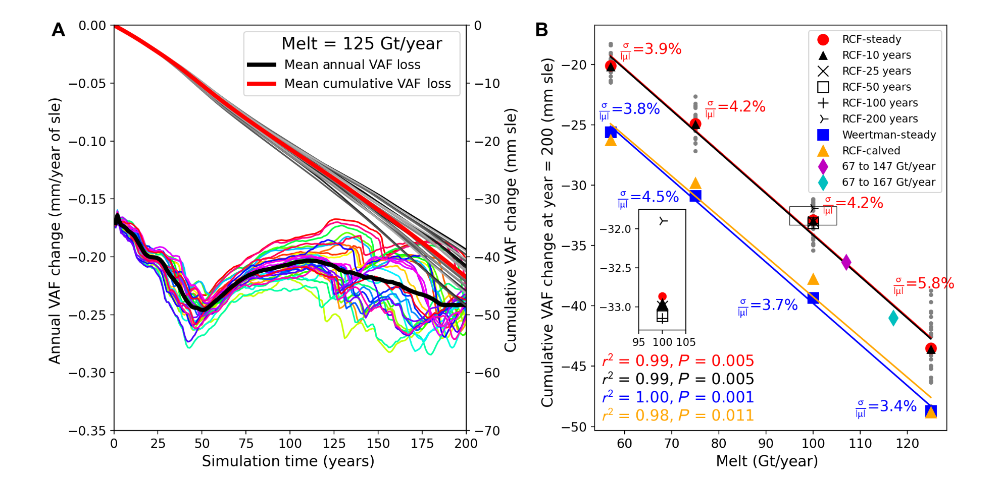
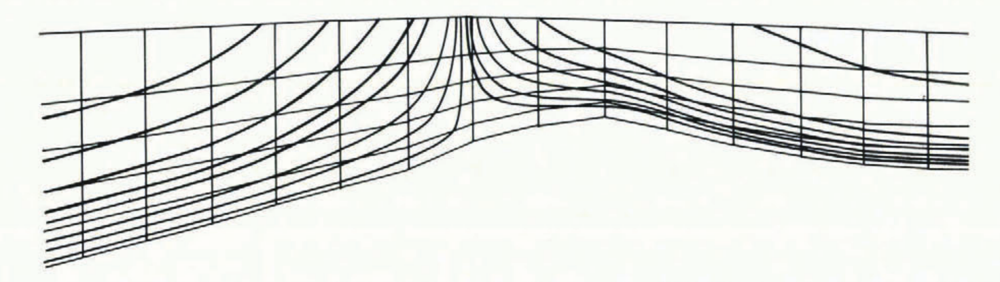
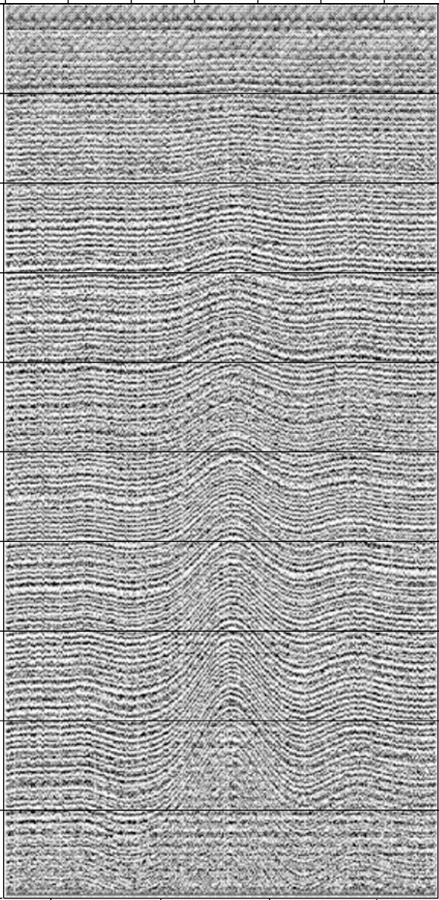
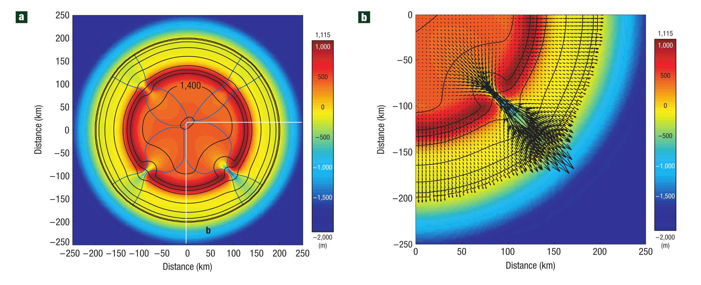

## Modeling glacier flow

Daniel Shapero, shapero@uw.edu

-v-

### Take-away message

There are new tools in finite element analysis that radically expand what kind of simulations a single person can do.

-v-

### Overview

* Introduction and how I got here
* Glacier flow, in broad strokes
* Terminus advance and retreat with duality

---

### Introduction

-v-

### Why study glaciers

<small>Emmons Glacier on Mt. Rainier and the White River, from NPS</small>

-v-

### Broad strokes

* You can think of glaciers as a **thin film** of **viscous** fluid, flowing under **gravity**.
* Other viscous gravity currents in the earth sciences: rainfall runoff, lava flows, debris flows.
* Ice is unusual because of **rheology**, **bed sliding**, and **iceberg calving**.

-v-

### Some history

* An applied math PhD teaches you to solve PDEs fast.
* **Physical scientists are not limited by speed first.**

-v-

**Goal**: make simulating glaciers easier and more interactive.

-v-

### Example: Joughin et al. (2021)

-v-

### Example: Joughin et al. (2021)

-v-

Built on Firedrake, a Python package for solving PDEs.

Specify the PDE using a *domain-specific language*.

---

### Glacier flow

-v-

<small>InSAR-based velocity map of Antarctica from NSIDC</small>

-v-

<iframe width="840" height="472" src="https://www.youtube.com/embed/YslhQZwvvu0?si=0e8BimEQXFGMc002?rel=0&modestbranding=1" title="YouTube video player" frameborder="0" allow="accelerometer; autoplay; clipboard-write; encrypted-media; gyroscope; picture-in-picture; web-share" referrerpolicy="strict-origin-when-cross-origin" allowfullscreen></iframe>

<small>Malaspina Glacier, Alaska. From Bas Altena</small>

-v-

### Mass conservation

* Glacier ice is nearly incompressible:
$$\nabla\cdot u = 0.$$
* Integrate in $z$ $\Rightarrow$ an evolution of ice thickness $h$:
$$\frac{\partial h}{\partial t} + \underbrace{\nabla\cdot h\bar u}\_{\text{flux}} = \underbrace{\dot a}\_{\text{accum}} - \underbrace{\dot m}\_{\text{melt}}$$

-v-

### Momentum conservation

* Reynolds number is super low:
$$\begin{align\*}
& \bcancel{\cancel{\frac{\partial}{\partial t}\rho u + \nabla\cdot \rho u\otimes u}} \\\\
& \qquad = \underbrace{\nabla\cdot\tau}\_{\text{viscosity}} - \underbrace{\nabla p}\_{\text{pressure}} + \underbrace{\rho g}\_{\text{gravity}}
\end{align\*}$$
* To close the system, we need a constitutive relation and boundary conditions.

-v-

### Constitutive laws

* For fluids, we care about the strain rate:
$$\dot\varepsilon = \frac{1}{2}\left(\nabla u + \nabla u^\*\right)$$
* For a Newtonian fluid, stress $\sim$ strain rate:
$$\underbrace{\tau}\_{\text{stress}} = 2\times\underbrace{\mu}\_{\text{viscosity}}\times\underbrace{\dot\varepsilon}\_{\text{strain rate}}$$

-v-

### Minimization principle

Stokes flow $\Leftrightarrow$ find a critical point of:

$$\dot F(u, p) = \int\_\Omega\left(\mu|\dot\varepsilon(u)|^2 - p\nabla\cdot u - \rho g\cdot u\right)\mathrm dx$$

-v-

### The Glen flow law

* **Glacier flow is *shear-thinning*.**
* Laboratory experiments in the 50s showed that
$$\dot\varepsilon = A|\tau|^{n - 1}\tau$$
where $n$ is somewhere between 3 and 4.
* Missing pieces: sum of several powers, anisotropy.

-v-

### Raymond arches

Simulated streamlines of flow near divide of Devon Island Ice Cap from Raymond (1983), *Deformation in the vicinity of ice divides*.

-v-

### Raymond arches

Radargram from Vaughan et al. (1999), *Distortion of isochronous layers revealed by ground-penetrating radar*.

Some of the best field evidence we have for the Glen flow law.

-v-

### Boundary conditions

* Notation: $\parallel$ = parallel, $\perp$ = perpendicular
* At the surface, stress is zero:
$$(\tau - pI)\_\perp = 0 \quad \text{at } z = z\_s$$
* At the base, velocity is equal to the melt rate:
$$u\_\parallel = \dot m \quad \text{at } z = z\_b$$
**What about friction?**

-v-

### Sliding law

* Friction is (maybe?) a power law:
$$u\_\perp = -K|\tau\_b|^{m - 1}\tau\_b$$
* The basal BC type depends on the direction!
* Missing pieces: hydrology, geology

-v-

### Sliding law

<small>

From Stokes and Clark (2003), *The Dubawnt Lake palaeo-ice stream: evidence for dynamic ice sheet behavior on the Canadian shield*

</small>

-v-

### Summary

Momentum balance is:
  - conservation law
  - flow law${}^{-1}$ (stress $\sim$ strain rate${}^{1/n}$)
  - sliding law${}^{-1}$ (drag $\sim$ speed${}^{1/m}$)
  - fixed normal velocity at the base
  - no stress at the surface

-v-

### Minimization principle

Nonlinear Stokes flow + sliding $\Leftrightarrow$ find a critical point of

$$\begin{align\*}
\dot F(u, p) & = \int\_\Omega\left(\frac{2n}{n + 1}A^{-\frac{1}{n}}|\dot\varepsilon(u)|^{\frac{1}{n} + 1} - p\nabla\cdot u - \rho g\cdot u\right)\mathrm dx \\\\
& \qquad\qquad + \int\_\Gamma\frac{m}{m + 1}K^{-\frac{1}{m}}|u\_\perp|^{\frac{1}{m} + 1}\mathrm d\gamma
\end{align\*}$$

---

### Approximations

-v-

### Thin-film flow

* Most glaciers are much thinner than they are wide.
* Simplifies the $z$-component of the Stokes eqns:
$$\bcancel{\cancel{\partial\_x\tau\_{zx}}} + \bcancel{\cancel{\partial\_y\tau\_{zy}}} + \partial\_z\left(\tau\_{zz} - p - \rho g (s - z)\right) = 0$$
$\Rightarrow$ we can eliminate the pressure.
* This gives the *first-order* equations.

-v-

* Q: Can we simplify out the $z$-dimension?
* A: **Yes, in two different ways!**

-v-

### The shallow ice approximation

* Assumption: vertical shear $\dot\varepsilon\_{xz}$, $\dot\varepsilon\_{yz}$ dominates.
* Consequence:
$$\begin{align\*}
\text{driving stress}: \quad \tau\_d & = -\rho gh\nabla s \\\\
\text{velocity}: \quad \bar u & = \frac{2hA}{n + 2}|\tau\_d|^{n - 1}\tau\_d
\end{align\*}$$

-v-

### The shallow ice approximation

* The good:
  - Simple to code: everyone does it!
  - **The model still works fine even when $h = 0$.**
* The bad:
  - Can't handle floating ice.
  - Assumes $\bar u \sim -\nabla s$ but DEMs are noisy.
  - Allstadt (2015): SIA can reproduce only 5\% of the speed of Emmons Glacier.

-v-

<small>

From Kessler et al. (2008), *Fjord insertion into continental margins driven by topographic steering of ice*

</small>

-v-

### The shallow stream approximation

* Assumption: horizontal extension $\dot\varepsilon\_{xx}$, $\dot\varepsilon\_{yy}$, $\dot\varepsilon\_{xy}$ dominates.
* Depth-average velocity now solves a PDE.
* Can handle floating ice + fast flow.
* **The model doesn't work when $h = 0$.**

-v-

### SSA

* A conservation law for *membrane stress* $M$:
$$\underbrace{\nabla\cdot hM}\_{\text{viscosity}} + \underbrace{\tau\_b}\_{\text{friction}} - \underbrace{\rho gh\nabla s}\_{\text{gravity}} = 0$$
* Much easier to solve than Stokes or 1st-order!
* Also has a minimization principle.

-v-

-v-

show some result obtained with SSA

-v-

### Approximations

%%{init: {
    'theme': 'light'
}%%
flowchart TD
    A[Stokes] -- "thin film" --> B[First-order];
    B -- "vertical shear" --> C[SIA];
    B -- "plug flow" --> D[SSA];

---

### Terminus evolution

-v-

<iframe width="840" height="472" src="https://www.youtube.com/embed/TWGR6FxFlt8?si=rTZGByPomHoLMCWy?rel=0" title="YouTube video player" frameborder="0" allow="accelerometer; autoplay; clipboard-write; encrypted-media; gyroscope; picture-in-picture; web-share" referrerpolicy="strict-origin-when-cross-origin" allowfullscreen></iframe>

<small>LeConte Glacier, Alaska. From Christian Kienholz</small>

-v-

### The dilemma

* SIA can move termini, SSA can't.
* SSA can capture velocity, SIA can't.
* **Can we obtain the best of both?**

%%{init: {
    'theme': 'light'
}%%
flowchart TD
    A[Stokes] -- "thin film" --> B[First-order];
    B -- "vertical shear" --> C[SIA];
    B -- "plug flow" --> D[SSA];
    C --> E[?];
    D --> E;

-v-

### Why is this a problem?

* The thing we want to minimize:
$$\dot F = \int_\Omega\left(\ldots h\cdot |\dot\varepsilon|^{4/3}\ldots\right)\mathrm dx$$
* When $h \to 0$, $\dot\varepsilon \to 0$ too.
* So the curvature looks like $0 \times \infty$!

-v-

### What is to be done?

**Every convex minimization problem has a *dual*.**

-v-

### Example: Stokes flow

The primal form:
$$\dot F(u, p) = \int\_\Omega\left(\mu|\dot\varepsilon(u)|^2 - p\nabla\cdot u - f\cdot u\right)\mathrm dx$$

The dual form:
$$\dot F(u, p, \tau) = \int\_\Omega\left(\frac{1}{4\mu}|\tau|^2 - \tau:\dot\varepsilon(u) + p\nabla\cdot u + f\cdot u\right)\mathrm dx$$

-v-

### Duality: why you should care

* More accurate approximation of stress
* **Inverts all constitutive relations**

-v-

### The dual form of nonlinear Stokes

$$\begin{align\*}
& \dot F = \int\_\Omega\left\\{\frac{2}{n + 1}A|\tau|^{n + 1} - \tau : \dot\varepsilon(u) + p\nabla\cdot u + \rho g\cdot u\right\\}\mathrm dx  \\\\
& \qquad\qquad + \int\_\Gamma\left\\{\frac{1}{m + 1}K|\tau_\perp|^{m + 1} + \tau\_\perp\cdot u\_\perp\right\\}\mathrm d\gamma
\end{align\*}$$

-v-

### The dual form of nonlinear Stokes

* Strain rate${}^{4/3}$ becomes stress${}^4$ -- no more cusp!
* Add terms to get composite flow / sliding laws.
* **The dual form of SSA is solvable at $h = 0$.**

-v-

### Larsen C simulation

<iframe width="600" height="350" data-src="https://www.youtube.com/embed/qq6lw7D9NR0?rel=0" frameborder="0" allowfullscreen></iframe>

<small>

From Shapero and de Diego (2025), *Numerical simulation of glacier terminus evolution using the dual action principle for momentum balance*

</small>

-v-

### Kangerlussuaq simulation

<iframe width="600" height="350" src="https://www.youtube.com/embed/01Kvp7Hoego?rel=0" frameborder="0" allowfullscreen></iframe>

<small>

From Shapero and de Diego (2025), *Numerical simulation of glacier terminus evolution using the dual action principle for momentum balance*

</small>

-v-

### Emmons Glacier

<iframe width="600" height="350" data-src="https://www.youtube.com/embed/RZO1fnDV3-w?rel=0" allowfullscreen></iframe>

<small>By my student Jon Maurer</small>

---

### Conclusion

-v-

### Take-away messages

* Minimization principles are awesome for numerics.
* Many ways to express the same physics problem.
* New tools in finite element analysis raise the bar.
* **Huge progress in CFD in the past 10 years.**

-v-

### Future work

* **Firn** densification
* **Heat flow** and phase change
* **Fabric** anisotropy and mechanics
* **Damage mechanics** and new calving laws
* **Contact problems** at grounding lines
* **Inverse problems** to estimate thickness, friction, viscosity from remote sensing data

-v-

I will solve PDEs for money: **shapero@uw.edu**

<video width="640" height="480" controls>
  <source src="karman-vortices.mp4" type="video/mp4">
  Your browser does not support the video tag.
</video>

