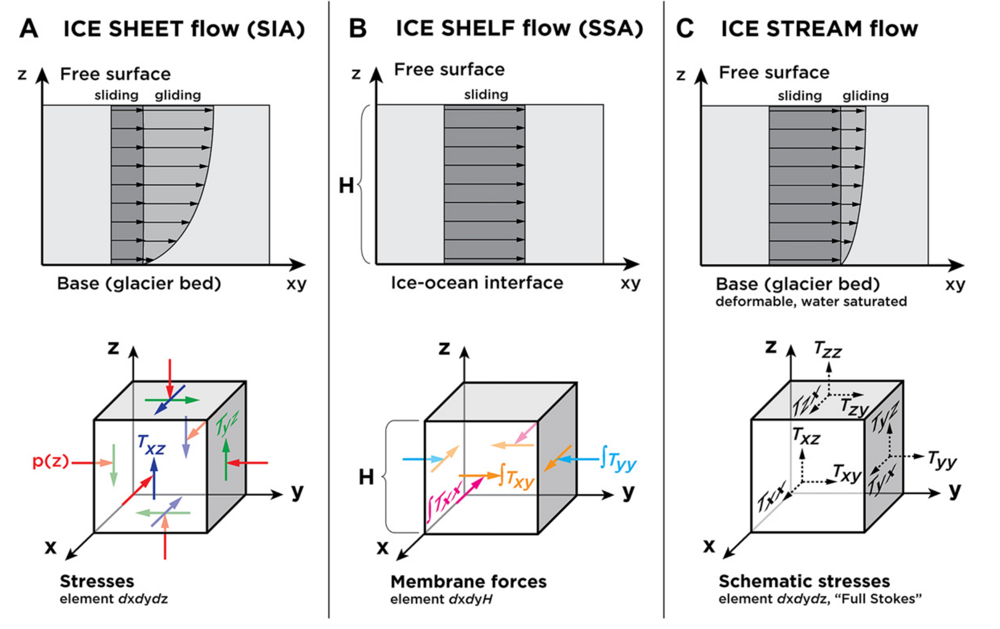
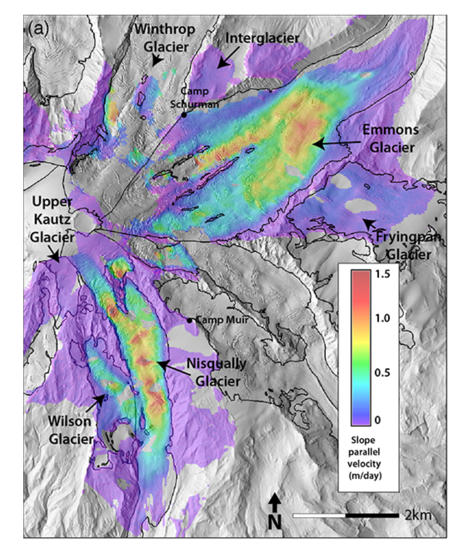
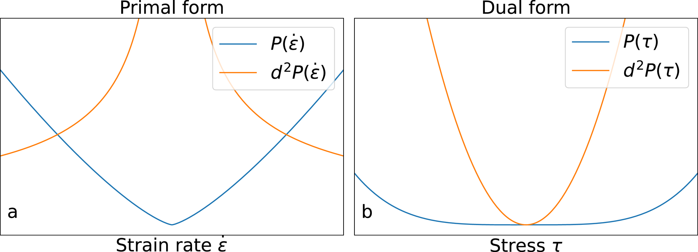
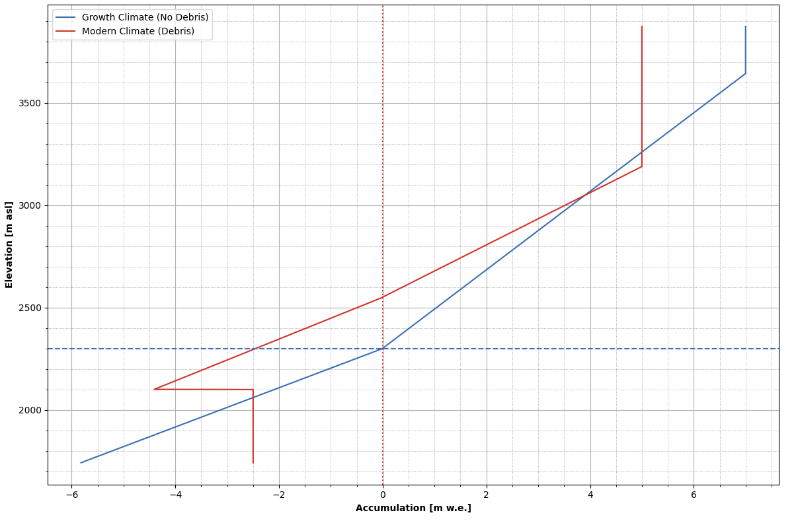
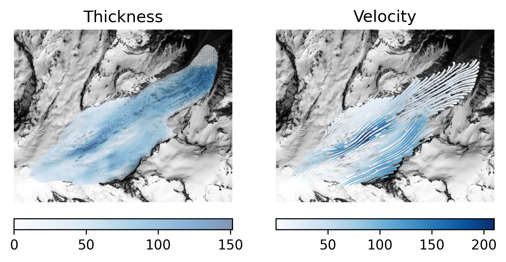
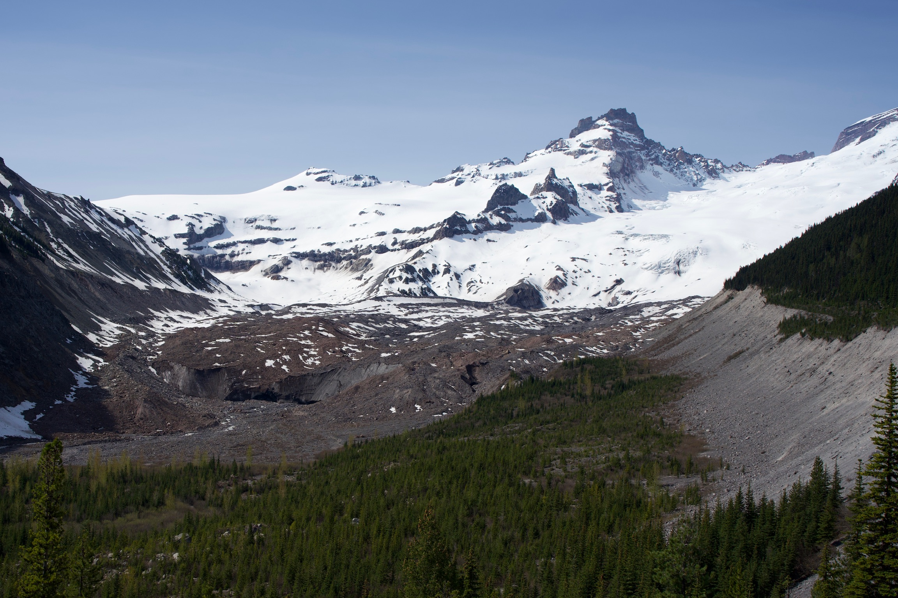
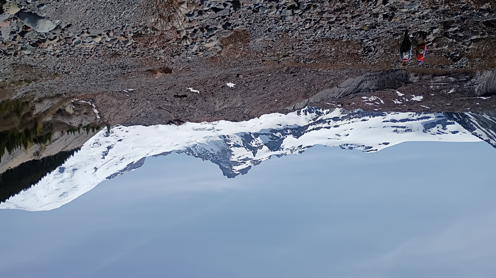
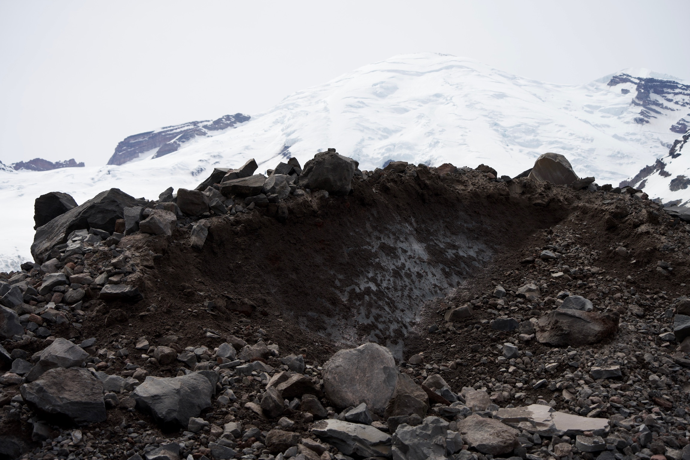
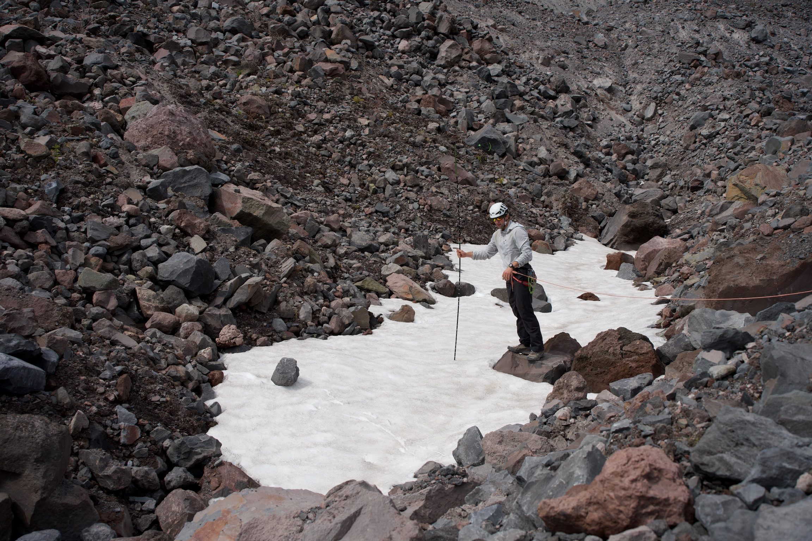
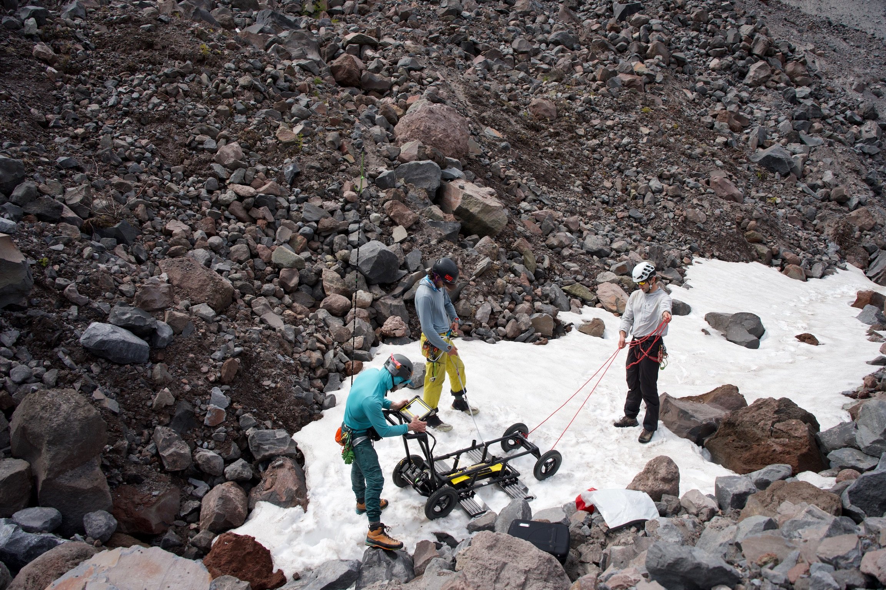

## Modeling glacier flow

Daniel Shapero, shapero@uw.edu

-v-

### Overview

* Glacier physics
* Minimization principles
* Field pics

---

### Introduction

-v-

### Why study glaciers

<small>Emmons Glacier on Mt. Rainier and the White River, from NPS</small>

-v-

### Broad strokes

* You can think of glaciers as a **thin film** of **viscous** fluid, flowing under **gravity**.
* Other viscous gravity currents in the earth sciences: rainfall runoff, lava flows, debris flows.
* Ice is unusual because of **rheology**, **bed sliding**, and **iceberg calving**.

-v-

**Goal**: make simulating glaciers easier and more interactive.

-v-

Built on Firedrake, a Python package for solving PDEs.

Specify the PDE using a *domain-specific language*.

---

### Glacier flow

-v-

<iframe width="840" height="472" src="https://www.youtube.com/embed/YslhQZwvvu0?si=0e8BimEQXFGMc002?rel=0&modestbranding=1" title="YouTube video player" frameborder="0" allow="accelerometer; autoplay; clipboard-write; encrypted-media; gyroscope; picture-in-picture; web-share" referrerpolicy="strict-origin-when-cross-origin" allowfullscreen></iframe>

<small>Malaspina Glacier, Alaska. From Bas Altena</small>

-v-

### Mass conservation

Glacier ice is nearly incompressible:
$$\nabla\cdot u = 0.$$
Integrate in $z$ $\Rightarrow$ an evolution of ice thickness $h$:
$$\frac{\partial h}{\partial t} + \underbrace{\nabla\cdot h\bar u}\_{\text{flux}} = \underbrace{\dot a}\_{\text{accum}} - \underbrace{\dot m}\_{\text{melt}}$$

-v-

### Momentum conservation

Starting point: the Stokes equations.

$$\text{stress divergence} + \text{pressure gradient} + \text{gravity} = 0$$

-v-

### Flow law

Ice flow is *shear-thinning*:
$$\text{strain rate} = \text{const} \times \text{stress}^n$$

-v-

### Raymond arches

<small>

Simulated streamlines of flow near divide of Devon Island Ice Cap from Raymond (1983), *Deformation in the vicinity of ice divides*.

</small>

-v-

### Raymond arches

Radargram from Vaughan et al. (1999), *Distortion of isochronous layers revealed by ground-penetrating radar*.

Some of the best field evidence we have for the Glen flow law.

-v-

### Sliding law

$$\text{sliding speed} = \text{const} \times \text{basal drag}^m$$

-v-

### Sliding law

<small>

From Stokes and Clark (2003), *The Dubawnt Lake palaeo-ice stream: evidence for dynamic ice sheet behavior on the Canadian shield*

</small>

-v-

### Simplifications

%%{init: {
    'theme': 'light'
}%%
flowchart TD
    A[Stokes] -- "thin film" --> B[First-order];
    B -- "vertical shear" --> C[SIA];
    B -- "plug flow" --> D[SSA];

-v-

<small>

From Kirchner et al. (2011), *Capabilities and limitations of numerical ice sheet models*

</small>

-v-

Allstadt et al. (2015), *Observations of seasonal and diurnal glacier velocities at Mount Rainier*.

**SIA can reproduce only 5\% of the speed of Emmons Glacier.**

-v-

### Tradeoffs

**SIA**: simple to code, works when $h = 0$; matches observations poorly and can't float

**SSA**: can handle floating ice and matches observations, but **doesn't work when $h = 0$**.

---

### Minimization principles

-v-

### Cast of characters

| Name  | Symbol
| ----  | ----:
| velocity | $u$
| thickness | $h$
| surface | $s$
| membrane stress | $M$
| basal stress | $\tau$

-v-

### Conservation law

The SSA is a conservation law for *membrane stress* $M$:

$$\underbrace{\nabla\cdot hM}\_{\text{stress div}} + \underbrace{\tau}\_{\text{friction}} - \underbrace{\rho gh\nabla s}\_{\text{gravity}} = 0$$

-v-

### Constitutive and sliding laws

Like the 3D case,
$$\underbrace{\dot\varepsilon}\_{\text{strain rate}} \equiv \frac{1}{2}\left(\nabla u + \nabla u^\*\right) = \underbrace{A|M|^{n - 1}\mathscr A M}\_{\text{membrane stress}^n}$$
and
$$\underbrace{u}\_{\substack{\text{sliding}\\\\ \text{speed}}} = -\underbrace{K|\tau|^{m - 1}\tau}\_{\text{basal drag}^m}$$

-v-

### Summary

Invert and substitute flow + sliding into conservation law $\Rightarrow$ big nonlinear PDE.

Throw a finite element solver at it and pray, or...?

-v-

**Some equations are really minimization.**

-v-

Solve SSA $\Leftrightarrow$ minimize

$$\begin{align\*}
\dot F(u) & = \int\_\Omega\Big\\{\text{const}\times\text{thickness}\times\text{strain rate}^{\frac{1}{n} + 1} \\\\
& \qquad\qquad + \text{const}\times\text{speed}^{\frac{1}{m} + 1} \\\\
& \qquad\qquad\qquad + \text{const}\times\text{thickness}\times\text{slope}\Big\\}\mathrm dx
\end{align\*}$$

-v-

Solve SSA $\Leftrightarrow$ minimize

$$\begin{align\*}
\dot F(u) & = \int\_\Omega\Big\\{\frac{2n}{n + 1}hA^{-\frac{1}{n}}|\dot\varepsilon|^{\frac{1}{n} + 1} \\\\
& \qquad\qquad\qquad + \frac{m}{m + 1}K^{-\frac{1}{m}}|u|^{\frac{1}{m} + 1} \\\\
& \qquad\qquad\qquad\qquad\qquad + \rho gh\nabla s\cdot u\Big\\}\mathrm dx
\end{align\*}$$

-v-

### Free power has a cusp

---

### Terminus evolution

-v-

<iframe width="840" height="472" src="https://www.youtube.com/embed/TWGR6FxFlt8?si=rTZGByPomHoLMCWy?rel=0" title="YouTube video player" frameborder="0" allow="accelerometer; autoplay; clipboard-write; encrypted-media; gyroscope; picture-in-picture; web-share" referrerpolicy="strict-origin-when-cross-origin" allowfullscreen></iframe>

<small>LeConte Glacier, Alaska. From Christian Kienholz</small>

-v-

### The dilemma

* SIA can move termini, SSA can't.
* SSA can capture velocity, SIA can't.
* **Can we obtain the best of both?**

%%{init: {
    'theme': 'light'
}%%
flowchart TD
    A[Stokes] -- "thin film" --> B[First-order];
    B -- "vertical shear" --> C[SIA];
    B -- "plug flow" --> D[SSA];
    C --> E[?];
    D --> E;

-v-

### What is to be done?

**Every minimization problem has a twin.**

-v-

### Dual form of SSA

Solve SSA $\Leftrightarrow$ find a critical point of

$$\begin{align\*}
\dot F(u, M, \tau) & = \int\_\Omega\Big\\{\text{const}\times\text{thickness}\times\text{membrane stress}^{n + 1} \\\\
& \qquad\qquad + \text{const}\times\text{basal stress}^{m + 1} \\\\
& \qquad\qquad\qquad + \text{velocity}\times\text{conservation law}\Big\\}\mathrm dx
\end{align\*}$$

-v-

### Dual form of SSA

Solve SSA $\Leftrightarrow$ find a critical point of

$$\begin{align\*}
\dot F(u, M, \tau) & = \int\_\Omega\Big\\{\frac{2}{n + 1}hA|M|^{n + 1} + \frac{1}{m + 1}K|\tau|^{m + 1} \\\\
& \qquad\qquad\qquad + u\cdot\left(\nabla\cdot hM + \tau - \rho gh\nabla s \right)\Big\\}\mathrm dx
\end{align\*}$$

-v-

### Dual free power goes flat

-v-

### Larsen C simulation

<iframe width="600" height="350" data-src="https://www.youtube.com/embed/qq6lw7D9NR0?rel=0" frameborder="0" allowfullscreen></iframe>

<small>

From Shapero and de Diego (2025), *Numerical simulation of glacier terminus evolution using the dual action principle for momentum balance*

</small>

-v-

### Kangerlussuaq simulation

<iframe width="600" height="350" src="https://www.youtube.com/embed/01Kvp7Hoego?rel=0" frameborder="0" allowfullscreen></iframe>

<small>

From Shapero and de Diego (2025), *Numerical simulation of glacier terminus evolution using the dual action principle for momentum balance*

</small>

-v-

### Emmons Glacier

<iframe width="600" height="350" data-src="https://www.youtube.com/embed/RZO1fnDV3-w?rel=0" allowfullscreen></iframe>

<small>By my student Jon Maurer</small>

-v-

### Emmons Glacier

Thin debris *enhances* melt, thick debris *inhibits*!

-v-

### Emmons Glacier

<small>By my student Jon Maurer</small>

---

### Emmons field work

<small>

Thanks to: Annie Spence, Elizabeth King, and Griffin Marshall; Claire Todd, CSUSB; Scott Beason, NPS; Earthscope

Photos by Elizabeth King

</small>

-v-

-v-

-v-

-v-

-v-

-v-

-v-

---

### Conclusion

-v-

### Take-away messages

* Minimization principles are *awesome* for numerics.
* Many ways to express the same physics problem.

---

### Proposal for a paper

-v-

<small>

From Roering (2008), *How well can hillslope evolution models "explain" topography?*

</small>

-v-

### Hillslope diffusion

$z$ = landscape height, $q$ = mass flux.

$$\nabla\cdot q = U;$$

$$q = -\frac{k\nabla z}{1 - S\_c^{-2}|\nabla z|^2}$$

-v-

### Minimization principle

$$\dot F(z) = -\int\_\Omega\left\\{\frac{kS\_c^2}{2}\ln\left(1 - \frac{|\nabla z|^2}{S\_c^2}\right) + Uz\right\\}\mathrm dx$$

I don't think this has been published before?

-v-

-v-

### Dual minimization principle

$$\begin{align\*}
\dot F(z, q) & = \int\_\Omega\Bigg\\{kS\_c^2\left(\sqrt{\frac{4|q|^2}{k^2S\_c^2} + 1} - 1 -\ln\left(\frac{2}{\sqrt{\frac{4|q|^2}{k^2S\_c^2} + 1} + 1}\right)\right) \\\\
& \qquad\qquad\qquad\qquad + (U - \nabla\cdot q)z\Bigg\\}\mathrm dx
\end{align\*}$$

And I sure as hell haven't seen this^ anywhere either

-v-

 

From **Your name here** and Shapero (2027), *Minimization principles for nonlinear hillslope transport*
